##  ТАСКА 1 — Порівняльна таблиця провайдерів

- **Summary:** [HW] Cloud Providers: порівняльна таблиця AWS vs GCP vs Azure vs Hetzner
- **Description:** Заповнена порівняльна [таблиця](./cloud%20providers/Порівняльна%20таблиця%20Cloud%20Providers.pdf) по чотирьох cloud провайдерах.

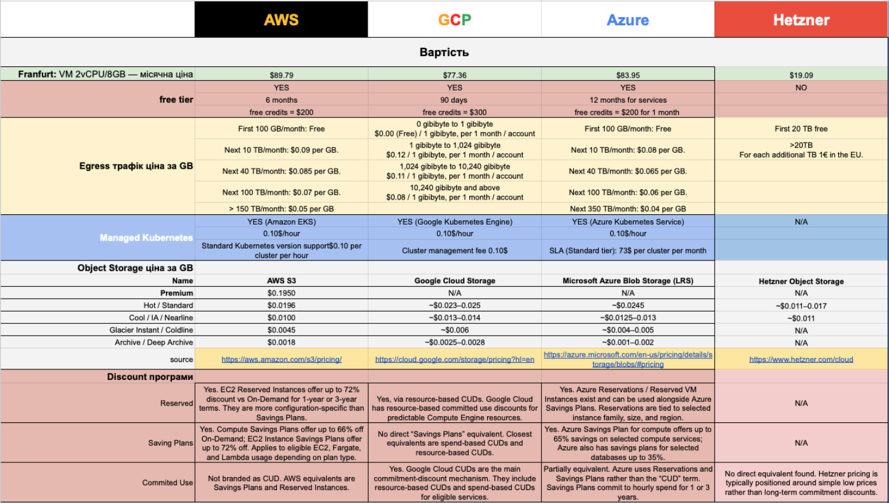

## ТАСКА 2 — IAM User з обмеженим dev-доступом

- **Summary:** [HW] AWS IAM: User, Group, Policy — read-only доступ до dev ресурсів
- **Description:** Створити IAM-інфраструктуру для dev-розробника, який може тільки переглядати ресурси в dev-середовищі.

### Підзадачі:

#### Sub-task 1: Розмітити тестові ресурси тегами

- тег `Environment=dev` на EC2 інстанс та S3 бакет
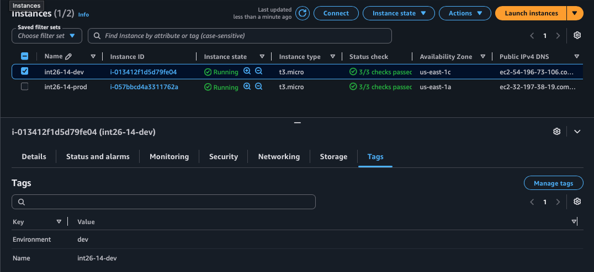 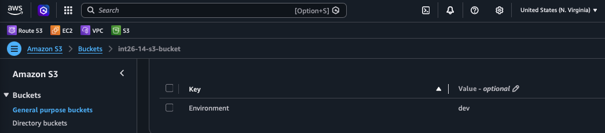

- тег `Environment=prod` на іншмй EC2 (для перевірки Deny)
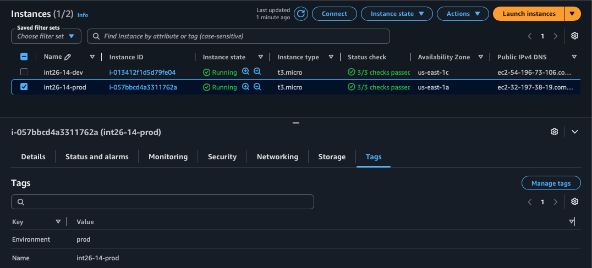

#### Sub-task 2: Створити IAM Policy [`DevReadOnlyByTag`](./policy.json)

- Allow: ec2:Describe*, rds:Describe*, s3:GetObject, s3:ListBucket — тільки для ресурсів з тегом `Environment=dev`

Доречі, Action ec2:Describe* для конкретного ресурсу неможливо, він є глобальним

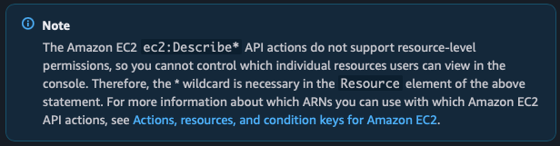

**Для S3** потрібно активувати `Bucket ABAC`, щоб була змога по тегу реалізувати доступ:

```
❯ aws s3 ls s3://int26-14-s3-bucket  --profile dev-viewer
2026-06-30 13:49:53     196064 argocd.png
2026-06-30 13:02:14     125632 bkend-cars-events.png
```

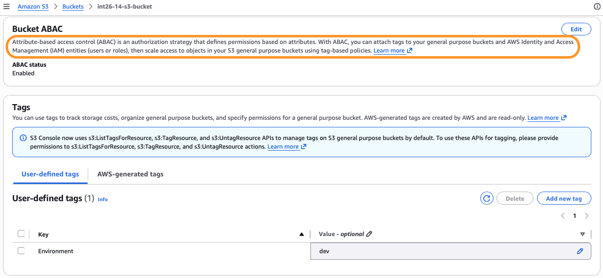

Також я пішов, трохи далі та в самому бакеті надав файлам tags: 

**check image with Tag Prod**
```
❯ aws s3api get-object \
--bucket int26-14-s3-bucket \
--key bkend-cars-events.png \
./bkend-cars-events.png \
--profile dev-viewer

aws: [ERROR]: An error occurred (AccessDenied) when calling the GetObject operation: User: arn:aws:iam::277869547993:user/dev.viewer is not authorized to perform: s3:GetObject on resource: "arn:aws:s3:::int26-14-s3-bucket/bkend-cars-events.png" with an explicit deny in an identity-based policy: arn:aws:iam::277869547993:policy/DevReadOnlyByTag
```

**check image with Tag Dev**

```
❯ aws s3api get-object \
--bucket int26-14-s3-bucket \
--key argocd.png \
./argocd.png \
--profile dev-viewer

{
    "AcceptRanges": "bytes",
    "LastModified": "2026-06-30T11:49:53+00:00",
    "ContentLength": 196064,
    "ETag": "\"c8bee517367e2002c61e2ac53b70e1db\"",
    "ChecksumCRC64NVME": "ESBcjQxa6Kg=",
    "ChecksumType": "FULL_OBJECT",
    "ContentType": "image/png",
    "ServerSideEncryption": "AES256",
    "Metadata": {}
}
```

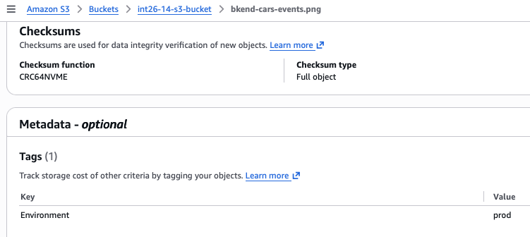
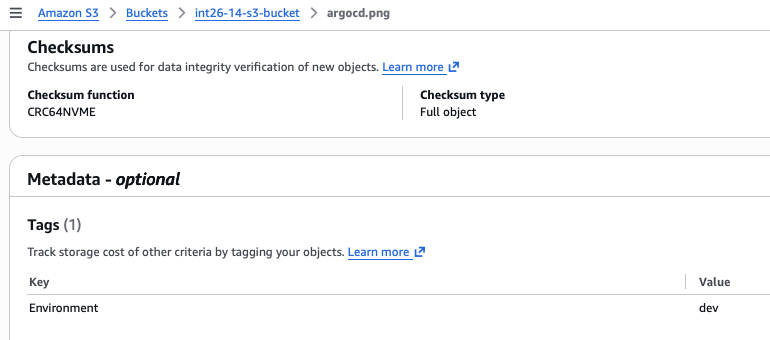

- Deny: всі дії на ресурси з тегом `Environment=prod`
- Allow: iam:Get*, iam:List*, cloudwatch:Describe* — глобально (без тегів)

#### Sub-task 3: Створити IAM Group та User

- Group: dev-readonly-team → прикріпити DevReadOnlyByTag
- User: dev.viewer → додати до group

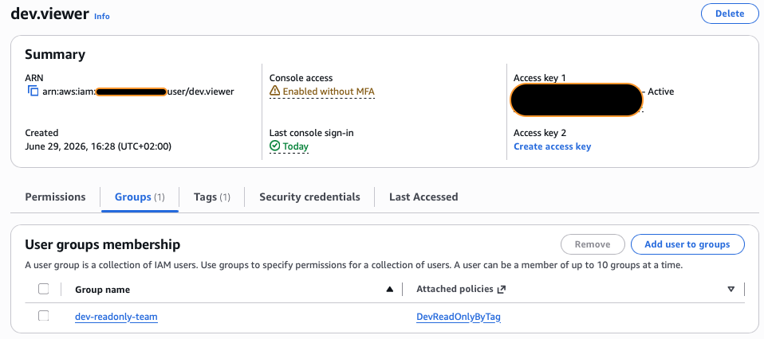

#### Sub-task 4: Перевірити доступи

- Залогінитись як dev.viewer
- Переглянути dev EC2 → зупинити dev EC2 → переглянути prod EC2
- Запустити IAM Policy Simulator → перевірити ec2:StopInstances і ec2:DescribeInstances

`aws sts get-caller-identity`:
```
❯ aws sts get-caller-identity --profile dev-viewer
{
    "UserId": "AIDAUBMSQ2HMS7LAAHUOT",
    "Account": "277869547993",
    "Arn": "arn:aws:iam::277869547993:user/dev.viewer"
}
```

`aws ec2 describe-instances --filters "Name=tag:Environment,Values=dev" --profile dev-viewer:`
```
{
    "Reservations": [
        {
            "ReservationId": "r-0ba1e69424c2e669f",
            "OwnerId": "277869547993",
            "Groups": [],
            "Instances": [
                {
                    "Architecture": "x86_64",
                    "BlockDeviceMappings": [
                        {
                            "DeviceName": "/dev/xvda",
                            "Ebs": {
                                "AttachTime": "2026-06-29T13:37:58+00:00",
                                "DeleteOnTermination": true,
                                "Status": "attached",
                                "VolumeId": "vol-0ea33ff97954bb40c",
                                "EbsCardIndex": 0
                            }
                        }
                    ],

                    ...

                    "PublicDnsName": "ec2-98-94-13-122.compute-1.amazonaws.com",
                    "StateTransitionReason": "",
                    "KeyName": "dev-itoutposts-key-pair",
                    "AmiLaunchIndex": 0,
                    "ProductCodes": [],
                    "InstanceType": "t3.micro",
                    "LaunchTime": "2026-06-30T10:50:29+00:00",
                    "Placement": {
                        "AvailabilityZoneId": "use1-az4",
                        "GroupName": "",
                        "Tenancy": "default",
                        "AvailabilityZone": "us-east-1c"
                    },
                    "Monitoring": {
                        "State": "disabled"
                    },
                    "SubnetId": "subnet-0f297f6d7daf142d3",
                    "VpcId": "vpc-07eafba8316cb6207",
                    "PrivateIpAddress": "",
                    "PublicIpAddress": ""
                }
            ]
        }
    ]
}                    
```


**prod:** `aws ec2 stop-instances --instance-ids i-057bbcd4a3311762a --profile dev-viewer:`

```
aws: [ERROR]: An error occurred (UnauthorizedOperation) when calling the StopInstances operation: You are not authorized to perform this operation. User: arn:aws:iam::277869547993:user/dev.viewer is not authorized to perform: ec2:StopInstances on resource: arn:aws:ec2:us-east-1:277869547993:instance/i-057bbcd4a3311762a with an explicit deny in an identity-based policy: arn:aws:iam::277869547993:policy/DevReadOnlyByTag.
```

**dev:** `aws ec2 stop-instances --instance-ids i-013412f1d5d79fe04 --profile dev-viewer:`
```
{
    "StoppingInstances": [
        {
            "InstanceId": "i-013412f1d5d79fe04",
            "CurrentState": {
                "Code": 64,
                "Name": "stopping"
            },
            "PreviousState": {
                "Code": 16,
                "Name": "running"
            }
        }
    ]
}
```

## ТАСКА 3 — Identity Center SSO

- **Summary:** [HW] AWS Identity Center: SSO User, Groups, 2 Permission Sets, CLI перевірка

- **Description:** Налаштувати централізований SSO доступ. Один портал → два рівні доступу.

### Підзадачі:

#### Sub-task 1: Підготовка і створення User

- Перевірити що AWS Organizations увімкнений
- Identity Center → Enable (якщо не увімкнений)
- Створити User: `john.doe`

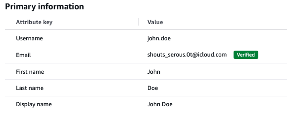

- Активувати акаунт через email

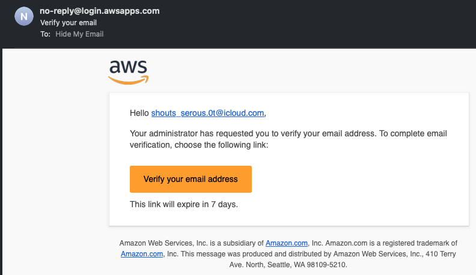

#### Sub-task 2: Створити Groups

- Group 1: cloud-admins
- Group 2: dev-readonly
- Додати john.doe в обидві групи

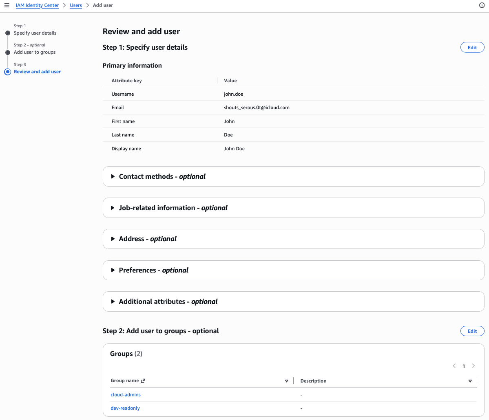

#### Sub-task 3: Створити 2 Permission Sets

- Permission Set 1: AdminAccess — predefined AdministratorAccess, session 4h

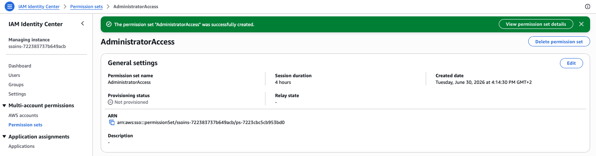

- Permission Set 2: DevReadOnly — custom inline policy з Таска 2, session 8h

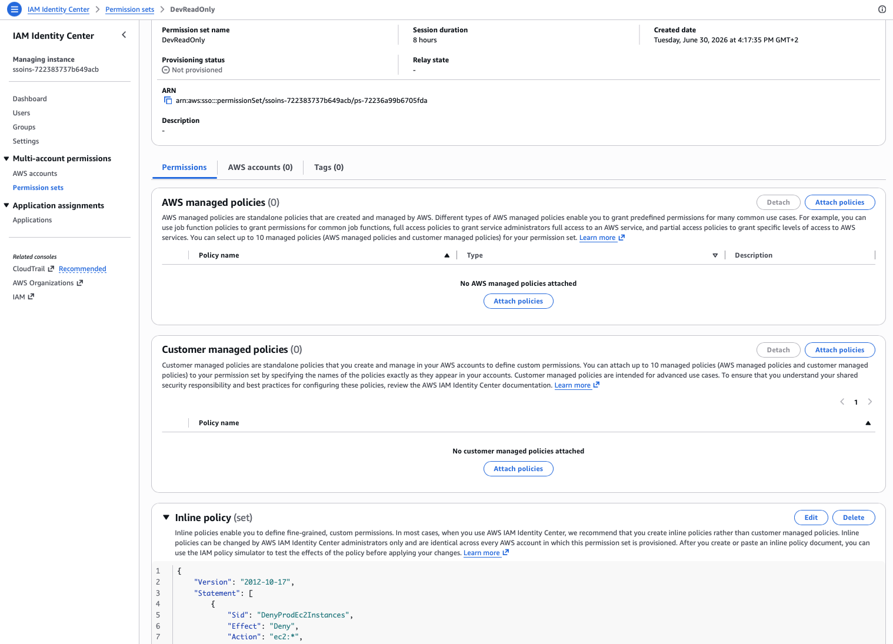

#### Sub-task 4: Призначити до акаунту та перевірити через портал

- Призначити обидва Permission Sets до AWS акаунту

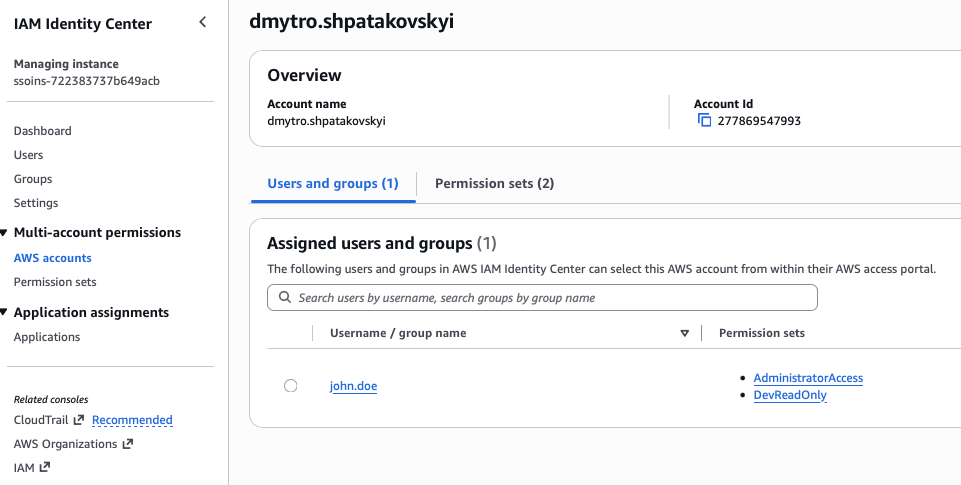

- Залогінитись через SSO Portal як john.doe

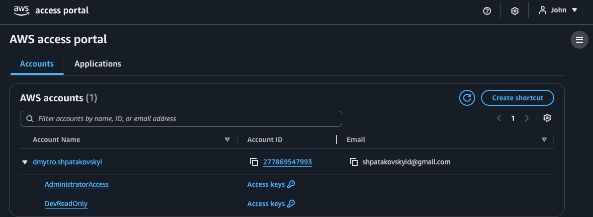

- Перевірити роль AdminAccess: зупинити EC2
- Перевірити роль DevReadOnly: зупинити EC2

#### Sub-task 5: Підключити CLI через SSO

**aws configure sso:**

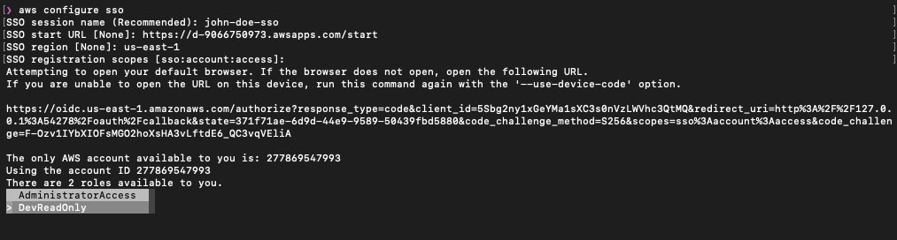

**Перевірка**

```
aws sts get-caller-identity --profile dev-readonly:
{
    "UserId": "AROAUBMSQ2HMYEGUZ4JCN:john.doe",
    "Account": "277869547993",
    "Arn": "arn:aws:sts::277869547993:assumed-role/AWSReservedSSO_DevReadOnly_df212b668f7581c2/john.doe"
}

aws sts get-caller-identity --profile admin:
{
    "UserId": "AROAUBMSQ2HMZCKCFUSV7:john.doe",
    "Account": "277869547993",
    "Arn": "arn:aws:sts::277869547993:assumed-role/AWSReservedSSO_AdministratorAccess_b31335e7337844bc/john.doe"
}

aws ec2 describe-instances --profile dev-readonly:
{
    "Reservations": [
        {
            "ReservationId": "r-0ba1e69424c2e669f",
            "OwnerId": "277869547993",
            "Groups": [],
            "Instances": [
                {
                    "Architecture": "x86_64",
                    "BlockDeviceMappings": [
                        {
                            "DeviceName": "/dev/xvda",
                            "Ebs": {
                                "AttachTime": "2026-06-29T13:37:58+00:00",
                                "DeleteOnTermination": true,
                                "Status": "attached",
                                "VolumeId": "vol-0ea33ff97954bb40c",
                                "EbsCardIndex": 0
                            }
                        }
                    ],
            
            ...

                    "InstanceType": "t3.micro",
                    "LaunchTime": "2026-06-29T13:40:07+00:00",
                    "Placement": {
                        "AvailabilityZoneId": "use1-az1",
                        "GroupName": "",
                        "Tenancy": "default",
                        "AvailabilityZone": "us-east-1a"
                    },
                    "Monitoring": {
                        "State": "disabled"
                    },
                    "SubnetId": "subnet-0c239673181c80fd7",
                    "VpcId": "vpc-07eafba8316cb6207",
                    "PrivateIpAddress": "172.31.15.221",
                    "PublicIpAddress": "32.197.38.19"
                }
            ]
        }
    ]
}            
```
`aws ec2 stop-instances --instance-ids i-XXXXXXXXXX --profile dev-readonly`

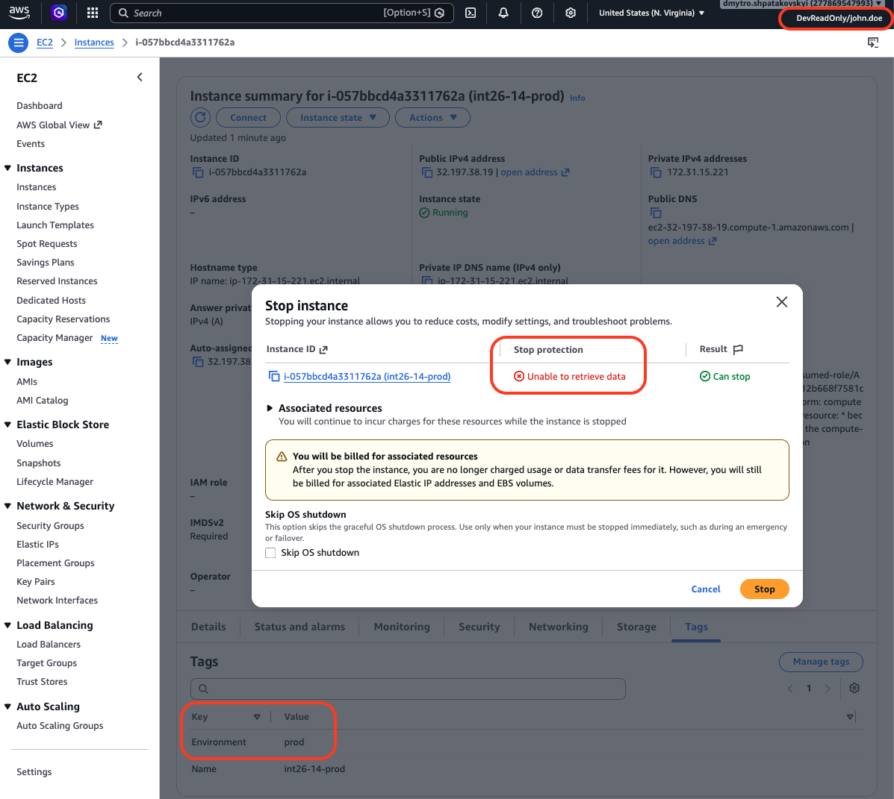

`aws ec2 stop-instances --instance-ids i-XXXXXXXXXX --profile admin`

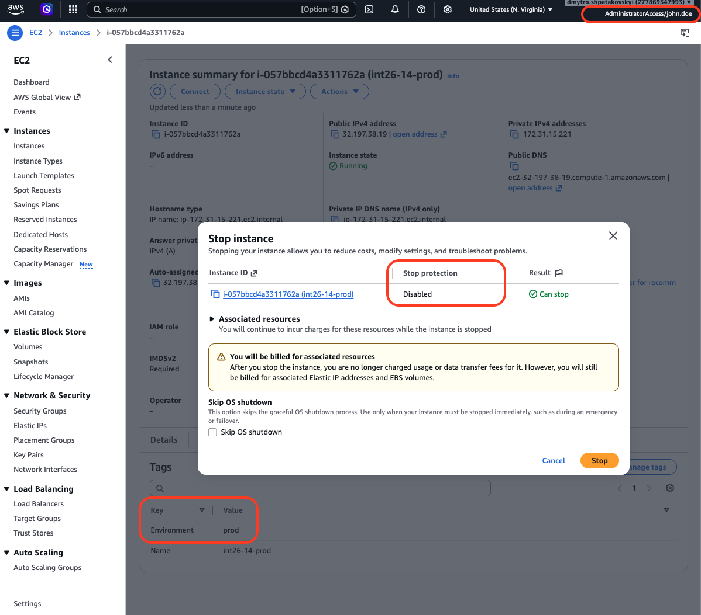

## ТАСКА 4 — Billing: доступ, бюджет, алерти

[screen shots](./scrshtsTask4/)