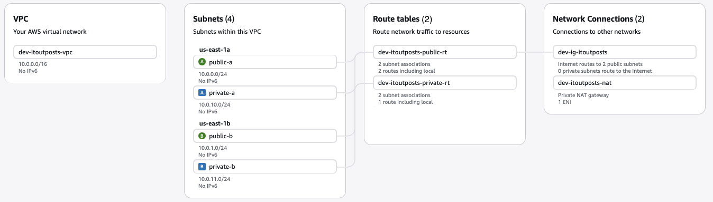

# Cloud Workshop - EC2 + Nginx + S3 + Domain + SSL (AWS)

Цей репозиторій містить виконання домашнього завдання, де необхідно розгорнути повний стек: VPC → EC2 → Nginx → S3 → Domain → SSL.

Флоу для користувача:
```
    1. Користувач в браузері відкриває лінк: https://<your-domain-address>
    2. Користувач бачить статичну сторінку (SSL сертифікат фіктивний!)
```

## 1. VPC
Необхідно cтворити базовий VPC (використовувся free tier).

```text
AWS/
├── VPCs
├── Create VPC/
│   ├── Name tag - optional (завжди заповнюйте теги, це дуже зручно, а ще це як коментар у коді): {environment}-{project}-{resource-type}
│   ├── IPv4 CIDR block ---> IPv4 CIDR manual input: 10.0.0.0/16 (Дефолтна VPC вже є в кожному акаунті (`172.31.0.0/16`), 
│   ├                        але її не рекомендується використовувати — сабнети там публічні, і потім важко переїжджати)
│   ├── Tags ---> environemnt: dev-ProjectName-vpc
│   
├── Subnets (Після створення VPC потрібно її необхідно розбити на підмережі)
│   ├ **Публічні** підмережі: машини мають публічну IP і виходять в інтернет через **Internet Gateway**
│   ├ **Приватні** підмережі: машини без публічної IP виходять в інтернет через **NAT Gateway**
│   ├ План підмережі нижче, в наступній схемі
│   ├ Create subnet/
│       ├── VPC (VPC ID) - вибрати ту яку ви створили, і саме завдяки зможете відрізнити від приватної default мережі
│       ├── Subnet settings:
│           ├── Subnet name: {environment}-{project}-{resource-type}
│           ├── Availability Zone: Створювати мінімум **2 підмережі кожного типу** для **High Availability**
│           ├── IPv4 subnet CIDR block: нижче в схемі
│           ├── Tags: додавайте теги обовʼязково
│           ├── Add new subnet (button): повторити ті самі кроки (нижче дивись в схемі, як запонювати IPv4 subnet CIDR block)
│
├── Internet gateways - двосторонні "ворота" між VPC та інтернетом, без нього VPC повністю ізольована.
│   ├ Один Internet gateway на VPC
│   ├ Після створення (Create IGW + Tags) — необхідно **attach** до VPC (https://youtu.be/43tIX7901Gs?si=7gEDCuyjIIBrPmsF)
│       ├ якщо одразу до діла, то дивитися з 9:35 (без теорії)
│
├── NAT gateways - перетворює приватні IP-адреси у свою публічну адресу для виходу в інтернет (ви можете це пропустити, бо в цьому завданні приватна мережа не використовується).
│   ├ Create NAT gateway/
│       ├ Name: {environment}-{project}-{resource-type}
│       ├ Availability mode: Zonal
│       ├ Subnet: вибрати ті/той, який створили (**по тегам знайдете одразу**). 
│           ├ Для **production** — обов'язково декілька NAT у різних AZ для стабільності.
│           ├ Для **dev** — достатньо одного (заощадження).
│       ├ Connectivity type: Public або Private
│       ├ Tags
│
├── Route tables - без нього трафік не "знатиме", куди йти. Потрібно два окремих Route Table (для приватної та публічної)
│   ├ Create route table/
│       ├ Name: {environment}-{project}-{resource-type}
│       ├ VPC: вибрати створенний VPC
│       ├ Tags
│     ├ Коли створили дві таблиці, то далі необхідно/
│       ├  для **Public Route Table** /   
│         ├ Edit routes (button)
│           ├ Add route (button)
│               ├ В полі **Destination** вибрати 0.0.0.0/0   # цих колонок явно не видно (тож те що вже заповнено має залишитися без зміни)
│               ├ Target: Internet Gateway
│                   ├ нижче зʼявиться ще одне поле: вибрати той Gateway, який створювали для мережі
│           ├ Subnet associations (tab)/ Edit subnet associations (button)/
│               ├ вибрати (поставити галочки) для публічної(их) мереж(і)
│
│       ├  для **Private Route Table** /
│           ├ Subnet associations (tab)/ Edit subnet associations (button)/
│               ├ вибрати (поставити галочки) для приватної(их) мереж(і)
```

**План мережі**
```
  public-a   → 10.0.0.0/24   (AZ: us-east-1a)
  public-b   → 10.0.1.0/24   (AZ: us-east-1b)
  private-a  → 10.0.10.0/24  (AZ: us-east-1a)
  private-b  → 10.0.11.0/24  (AZ: us-east-1b)
```


## 2. EC2 + Security Group + Elastic IP + NGINX

Для того щоб виконувався другий крок користувацького флоу необхідні ресурси сервера.
Заходимо на EC2 і далі тиснемо на Launch instance:

**EC2 запуск**

```text
AWS/
│   ├── EC2 ---> Launche Instance /
│       ├── Application and OS Images + Instance type (вибирався free tier eligible)
│       ├── Key pair (login) ---> Create new key pair
│           ├── Key pair name: {environment}-{project}-{resource-type}
│           ├── Key pair type: RSA
│           ├── Private key file format: .pem
│
│       ├── Network settings /
│           ├── VPC: що створили
│           ├── Subnet: що створили (public)
│           ├── Auto-assign public IP: Enable
│           ├── Firewall (security groups): Create security group (залишив як є)
│
│       ├── Advanced details /
│           ├── IAM instance profile: можете вибрати існуючий, але процес його створення у наступному розділі 😅 (тож спочатку створіть їх, як профіки)
│           ├── User data: в описі домашнього завдання є "User Data при Launch EC2" з баш командами (встанновлення nginx та aws commmands)
│               ├── 1. створити файлик для скриптів
│               ├── 2. натиснути choose file (вибрати цей скрипт)
```

**Elastic IPs налаштування**

Цей сервіс необхідний для, щоб у сервера (EC2) була постійна публічна IPv4-адреса, яка не змінюється при зупинці/запуску інстансу.
Зазвичай публічний IPv4, який AWS видає EC2 автоматично, динамічний:
* зупинили EC2 → публічний IP звільнився;
* запустити знову → EC2 може отримати інший публічний IP.

Elastic IP вирішує цю проблему: це статична публічна IPv4-адреса, закріплена за вашим AWS-акаунтом.

Приклад:<br>
Ви маєте веб-сервер на EC2, і домен example.com вказує на його IP.<br>
Без Elastic IP після перезапуску EC2 IP-address може змінитися, і сайт перестане відкриватися за старим DNS-записом.<br>
З Elastic IP адрес залишається тим самим.

Інструкція налаштування Elastic IP addresses з EC2: [youtube](https://www.youtube.com/watch?v=4T6fk6UtpsE)

Далі перевірити виконану роботу по налаштуванню: `ssh -i "your-key.pem" your-user@<elastic-ip>`

## 3. IAM Role & Policy + Amazon S3 + User Data

**IAM Role & Policy налаштування**

По завданню необхідно створити та налаштувати роль та полісі для роботи EC2 з Amazon S3:
* Role: ec2-s3-dev-readonly
* Policy: доступ до dev-* buckets (GetObject, ListBucket)

1. Створюємо Policy ([User guide JSON](https://docs.aws.amazon.com/IAM/latest/UserGuide/access_policies_examples.html)):
```
AWS (IAM)
│   ├── Policies (create policy) /
│       ├── Policy editor (JSON):
│           ├── Choose a service: S3
│           ├── приклад мого JSON: dev-readOnly-policy.json
│         ├── Next (button)
│           ├── Policy name: {environment}-{project}-{resource-type}
│           ├── Tags: {environemt: dev}
```

2. Створюємо Role для Amazon S3:
```
AWS (IAM)
│   ├── Roles (create role) /
│       ├── Trusted entity type: AWS service
│       ├── Use case: S3
│     ├── Next (button)
│       ├── Permissions policies /
│           ├── Filter by Type: Customer managed (вибрати створену Role)
│     ├── Next (button)
│       ├── Role name: {environment}-{project}-{resource-type}
│       ├── Tags: {environemt: dev}
```

3. Налаштвоуєм наш EC2 та Role:
```
AWS (EC2)
│   ├── Instances /
│     ├── Створений EC2 --> Actions (button) --> Security --> Modify IAM role /
│       ├── IAM role: вибрати створену Role
```

Команда перевірки вашої ролі: `aws sts get-caller-identity`<br>
Має видати відповідь:<br>
```
{
    "UserId": "XXX-XXX",
    "Account": "XXX-XXX",
    "Arn": "XXX-XXX:assued-role/{environment}-{project}-{resource-type}/XXX"
}
```

**Amazon S3 налаштування**

Тут не мудрив: все зроблено по дефолту. Потім туди завантажив скрипти *_monitor.sh + index.html


**NGINX налаштування**

Є два варіанти (виконувати вже на самому EC2):<br>
    * як профіки (User Data): виконати Advanced details із `EC2 запуск` і далі запустити файл на виконання<br>
    * як новачок:<br>
```
    1. створити файл setup.sh (форма довільна)
    2. запустити файл через sudo
```

## 4. Personal domain + A Record + SSL