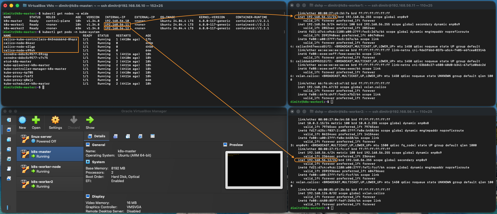
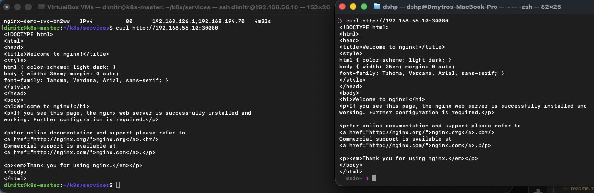
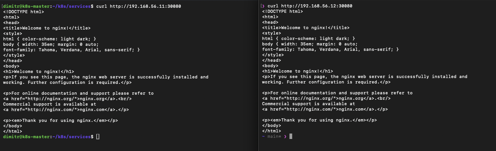

# Kubernetes Cluster with kubeadm on VirtualBox

## Опис проєкту

Цей проєкт демонструє ручне розгортання Kubernetes-кластера у VirtualBox за допомогою `kubeadm`.

Кластер складається з:

- 1 control-plane node: `k8s-master`
- 2 worker nodes: `k8s-worker1`, `k8s-worker2`

Після створення кластера було підключено worker-ноди, задеплоєно тестовий застосунок `nginx`, перевірено роботу `Deployment`, `Service`, `scaling`, `rolling update`, `rollback` та `self-healing`.

Також було реалізовано деплой власного застосунку з приватного Docker Registry, який працює всередині Kubernetes-кластера на master-node.



---

## Зміст

- [Архітектура кластера](#архітектура-кластера)
- [Ініціалізація Kubernetes control plane](#ініціалізація-kubernetes-control-plane)
- [Підключення worker nodes](#підключення-worker-nodes)
- [Тестовий застосунок nginx](#тестовий-застосунок-nginx)
- [Service NodePort](#service-nodeport)
- [Scaling](#scaling)
- [Rolling update](#rolling-update)
- [Rollback](#rollback)
- [Self-healing](#self-healing)
- [Схема залежностей Kubernetes-ресурсів](#схема-залежностей-kubernetes-ресурсів)
- [Private Docker Registry](#private-docker-registry)
- [Деплой застосунку cars-app](#деплой-застосунку-cars-app)
- [MongoDB з StatefulSet та PersistentVolume](#mongodb-з-statefulset-та-persistentvolume)
- [Backend monitor-api](#backend-monitor-api)
- [Проблема DNS Service Discovery](#проблема-dns-service-discovery)
- [Фінальний результат](#фінальний-результат)

---

## Архітектура кластера

Кластер розгорнуто у VirtualBox.

| Node | Role | IP | Призначення |
|---|---|---|---|
| `k8s-master` | control-plane | `192.168.56.10` | Kubernetes control plane, private Docker Registry |
| `k8s-worker1` | worker | `192.168.56.11` | application workloads |
| `k8s-worker2` | worker | `192.168.56.12` | database workloads |

Для розподілу workload-ів були додані node labels:

```bash
kubectl label node k8s-worker1 role=app
kubectl label node k8s-worker2 role=db
```

Перевірка:

```bash
kubectl get nodes -L role
```

Результат:

```text
NAME          STATUS   ROLES           AGE   VERSION   ROLE
k8s-master    Ready    control-plane   45h   v1.34.8
k8s-worker1   Ready    <none>          45h   v1.34.8   app
k8s-worker2   Ready    <none>          27h   v1.34.8   db
```

---

## Ініціалізація Kubernetes control plane

Control plane було ініціалізовано за допомогою `kubeadm init`.

Після успішної ініціалізації Kubernetes вивів повідомлення:

```text
Your Kubernetes control-plane has initialized successfully!

To start using your cluster, you need to run the following as a regular user:

  mkdir -p $HOME/.kube
  sudo cp -i /etc/kubernetes/admin.conf $HOME/.kube/config
  sudo chown $(id -u):$(id -g) $HOME/.kube/config

Alternatively, if you are the root user, you can run:

  export KUBECONFIG=/etc/kubernetes/admin.conf

You should now deploy a pod network to the cluster.
Run "kubectl apply -f [podnetwork].yaml" with one of the options listed at:
  https://kubernetes.io/docs/concepts/cluster-administration/addons/
```

Після цього потрібно налаштувати доступ до кластера через `kubectl`:

```bash
mkdir -p $HOME/.kube
sudo cp -i /etc/kubernetes/admin.conf $HOME/.kube/config
sudo chown $(id -u):$(id -g) $HOME/.kube/config
```

---

## Підключення worker nodes

Worker-ноди підключаються до кластера через `kubeadm join`.

Приклад команди, яку потрібно виконати на кожній worker-node:

```bash
kubeadm join 192.168.56.10:6443 --token 9k8as9.uk9jkq6tslo3sdd \
  --discovery-token-ca-cert-hash sha256:b0c3bbb815918f3b3ee41c551a7cbb080ab1d77626e21sss
```

Після підключення перевіряємо статус нод:

```bash
kubectl get nodes
```

Очікуваний результат — усі ноди мають бути у статусі `Ready`.

---

## Тестовий застосунок nginx

Для перевірки роботи Kubernetes було створено тестовий застосунок `nginx-demo` у namespace `test-zastosunok`.

Deployment-файл:

```text
./deployments/nginx-config.yaml
```

Перевірка Deployment, ReplicaSet та Pod-ів:

```bash
kubectl get deployment,rs,pod -n test-zastosunok -o wide
```

Результат:

```text
NAME                         READY   UP-TO-DATE   AVAILABLE   AGE   CONTAINERS   IMAGES       SELECTOR
deployment.apps/nginx-demo   2/2     2            2           21m   nginx        nginx:1.25   app=nginx-demo

NAME                                    DESIRED   CURRENT   READY   AGE   CONTAINERS   IMAGES       SELECTOR
replicaset.apps/nginx-demo-757ddcf8d5   2         2         2       21m   nginx        nginx:1.25   app=nginx-demo,pod-template-hash=757ddcf8d5

NAME                              READY   STATUS    RESTARTS   AGE   IP               NODE          NOMINATED NODE   READINESS GATES
pod/nginx-demo-757ddcf8d5-6kcjr   1/1     Running   0          21m   192.168.126.1    k8s-worker2   <none>           <none>
pod/nginx-demo-757ddcf8d5-7bc85   1/1     Running   0          21m   192.168.194.70   k8s-worker1   <none>           <none>
```

---

## Service NodePort

Для доступу до nginx було створено `NodePort` Service.

Service-файл:

```text
./services/nginx-service.yaml
```

Застосування Service:

```bash
kubectl apply -f nginx-service.yaml
```

Результат:

```text
service/nginx-demo-svc created
```

Перевірка Service:

```bash
kubectl get svc -n test-zastosunok -o wide
```

```text
NAME             TYPE       CLUSTER-IP       EXTERNAL-IP   PORT(S)        AGE   SELECTOR
nginx-demo-svc   NodePort   10.105.168.110   <none>        80:30080/TCP   6s    app=nginx-demo
```

Перевірка EndpointSlices:

```bash
kubectl get endpointslices -n test-zastosunok
```

```text
NAME                   ADDRESSTYPE   PORTS   ENDPOINTS                      AGE
nginx-demo-svc-bm2ww   IPv4          80      192.168.126.1,192.168.194.70   4m32s
```

Застосунок доступний через NodePort:

```text
192.168.56.10:30080
192.168.56.11:30080
192.168.56.12:30080
```



---

## Scaling

Scaling перевірявся через зміну кількості реплік Deployment.

Початковий стан:

```bash
kubectl get pods -n test-zastosunok -o wide
```

```text
NAME                          READY   STATUS    RESTARTS   AGE     IP               NODE          NOMINATED NODE   READINESS GATES
nginx-demo-757ddcf8d5-6kcjr   1/1     Running   0          4h50m   192.168.126.1    k8s-worker2   <none>           <none>
nginx-demo-757ddcf8d5-7bc85   1/1     Running   0          4h50m   192.168.194.70   k8s-worker1   <none>           <none>
```

Збільшення кількості реплік до 5:

```bash
kubectl scale deployment nginx-demo -n test-zastosunok --replicas=5
```

```text
deployment.apps/nginx-demo scaled
```

Перевірка:

```bash
kubectl get pods -n test-zastosunok -o wide
```

```text
NAME                          READY   STATUS    RESTARTS   AGE     IP               NODE          NOMINATED NODE   READINESS GATES
nginx-demo-757ddcf8d5-5xhgc   0/1     Running   0          7s      192.168.194.71   k8s-worker1   <none>           <none>
nginx-demo-757ddcf8d5-6kcjr   1/1     Running   0          4h50m   192.168.126.1    k8s-worker2   <none>           <none>
nginx-demo-757ddcf8d5-7bc85   1/1     Running   0          4h50m   192.168.194.70   k8s-worker1   <none>           <none>
nginx-demo-757ddcf8d5-gfd9l   0/1     Running   0          7s      192.168.126.3    k8s-worker2   <none>           <none>
nginx-demo-757ddcf8d5-mzx74   0/1     Running   0          7s      192.168.126.2    k8s-worker2   <none>           <none>
```

Через деякий час частина Pod-ів перейшла у `CrashLoopBackOff`, тому кількість реплік було зменшено до 3:

```bash
kubectl scale deployment nginx-demo -n test-zastosunok --replicas=3
```

Результат:

```text
NAME                          READY   STATUS    RESTARTS   AGE     IP               NODE          NOMINATED NODE   READINESS GATES
nginx-demo-757ddcf8d5-5xhgc   1/1     Running   0          5m4s    192.168.194.71   k8s-worker1   <none>           <none>
nginx-demo-757ddcf8d5-6kcjr   1/1     Running   0          4h55m   192.168.126.1    k8s-worker2   <none>           <none>
nginx-demo-757ddcf8d5-7bc85   1/1     Running   0          4h55m   192.168.194.70   k8s-worker1   <none>           <none>
```



---

## Rolling update

Rolling update було виконано через оновлення Docker image з `nginx:1.25` до `nginx:1.26`.

```bash
kubectl set image deployment/nginx-demo nginx=nginx:1.26 -n test-zastosunok
```

Перевірка rollout:

```bash
kubectl rollout status deployment/nginx-demo -n test-zastosunok
```

```text
deployment "nginx-demo" successfully rolled out
```

Перевірка ресурсів:

```bash
kubectl get deployment,rs,pod,svc -n test-zastosunok -o wide
```

```text
NAME                         READY   UP-TO-DATE   AVAILABLE   AGE    CONTAINERS   IMAGES       SELECTOR
deployment.apps/nginx-demo   3/3     3            3           5h5m   nginx        nginx:1.26   app=nginx-demo

NAME                                    DESIRED   CURRENT   READY   AGE     CONTAINERS   IMAGES       SELECTOR
replicaset.apps/nginx-demo-6c74d78f66   3         3         3       2m14s   nginx        nginx:1.26   app=nginx-demo,pod-template-hash=6c74d78f66
replicaset.apps/nginx-demo-757ddcf8d5   0         0         0       5h5m    nginx        nginx:1.25   app=nginx-demo,pod-template-hash=757ddcf8d5
```

Перевірка історії rollout:

```bash
kubectl rollout history deployment/nginx-demo -n test-zastosunok
```

```text
deployment.apps/nginx-demo
REVISION  CHANGE-CAUSE
1         <none>
2         <none>
```

---

## Rollback

Rollback було виконано командою:

```bash
kubectl rollout undo deployment/nginx-demo -n test-zastosunok
```

Перевірка статусу:

```bash
kubectl rollout status deployment/nginx-demo -n test-zastosunok
```

```text
deployment "nginx-demo" successfully rolled out
```

Перевірка image після rollback:

```bash
kubectl describe deployment nginx-demo -n test-zastosunok | grep Image
```

```text
Image:         nginx:1.25
```

Після rollback активною знову стала ReplicaSet з image `nginx:1.25`:

```text
NAME                         READY   UP-TO-DATE   AVAILABLE   AGE     CONTAINERS   IMAGES       SELECTOR
deployment.apps/nginx-demo   3/3     3            3           5h12m   nginx        nginx:1.25   app=nginx-demo

NAME                                    DESIRED   CURRENT   READY   AGE     CONTAINERS   IMAGES       SELECTOR
replicaset.apps/nginx-demo-6c74d78f66   0         0         0       9m29s   nginx        nginx:1.26   app=nginx-demo,pod-template-hash=6c74d78f66
replicaset.apps/nginx-demo-757ddcf8d5   3         3         3       5h12m   nginx        nginx:1.25   app=nginx-demo,pod-template-hash=757ddcf8d5
```

---

## Self-healing

Self-healing перевірявся через ручне видалення одного Pod-а.

Початковий стан:

```bash
kubectl get pods -n test-zastosunok
```

```text
NAME                          READY   STATUS    RESTARTS        AGE
nginx-demo-757ddcf8d5-q4nh9   1/1     Running   0               5m22s
nginx-demo-757ddcf8d5-t584j   1/1     Running   4 (4m38s ago)   7m10s
```

Видалення Pod-а:

```bash
kubectl delete pod -n test-zastosunok nginx-demo-757ddcf8d5-t584j
```

Спостереження за Pod-ами:

```bash
kubectl get pods -n test-zastosunok -w
```

```text
NAME                          READY   STATUS    RESTARTS   AGE
nginx-demo-757ddcf8d5-q4nh9   1/1     Running   0          6m34s
nginx-demo-757ddcf8d5-zhhhs   0/1     Running   0          25s
nginx-demo-757ddcf8d5-zhhhs   0/1     Running   1          32s
nginx-demo-757ddcf8d5-zhhhs   0/1     Running   2          72s
nginx-demo-757ddcf8d5-zhhhs   0/1     Running   3          112s
nginx-demo-757ddcf8d5-zhhhs   1/1     Running   3          2m24s
```

Kubernetes автоматично створив новий Pod, тому що Deployment через ReplicaSet підтримує бажану кількість реплік.

---

## Схема залежностей Kubernetes-ресурсів

```text
Kubernetes Cluster
│
└── Namespace: test-zastosunok
    │
    ├── Deployment: nginx-demo
    │   │
    │   ├── ReplicaSet: nginx-demo-757ddcf8d5
    │   │   │
    │   │   ├── Pod: nginx-demo-xxxxx
    │   │   │   └── Container: nginx
    │   │   │
    │   │   └── Pod: nginx-demo-yyyyy
    │   │       └── Container: nginx
    │   │
    │   └── Desired state:
    │       ├── image: nginx:1.25
    │       └── replicas: 2
    │
    └── Service: nginx-demo-svc
        │
        ├── type: NodePort
        ├── nodePort: 30080
        └── selector:
            └── app=nginx-demo
                    │
                    ├── matches Pod: nginx-demo-xxxxx
                    └── matches Pod: nginx-demo-yyyyy
```

---

## Private Docker Registry

Для виконання вимоги з `imagePullSecrets` було використано private Docker Registry всередині Kubernetes-кластера.

Оскільки на момент виконання роботи registry був публічним, було прийнято рішення розгорнути private registry на master-node.

Опис реалізації знаходиться тут:

```text
./k8s-registry/k8s-registry.md
```

Перевірка catalog у registry:

```bash
curl -u dimitr:password \
  http://192.168.56.10:30500/v2/_catalog
```

Результат:

```json
{"repositories":["monitor-api","monitor-frontend"]}
```

У private registry вже є два web images:

- `monitor-api`
- `monitor-frontend`

---

## Деплой застосунку cars-app

### Створення namespace

```bash
kubectl create namespace cars-app
```

Результат:

```text
namespace/cars-app created
```

Перевірка namespace:

```bash
kubectl get ns
```

```text
NAME              STATUS   AGE
cars-app          Active   7s
default           Active   43h
kube-node-lease   Active   43h
kube-public       Active   43h
kube-system       Active   43h
registry          Active   4h56m
```

### Створення imagePullSecret

```bash
kubectl create secret docker-registry registry-secret \
  --docker-server=192.168.56.10:30500 \
  --docker-username=dimitr \
  --docker-password=password \
  -n cars-app
```

Результат:

```text
secret/registry-secret created
```

Перевірка Secret:

```bash
kubectl get secret -n cars-app
```

```text
NAME              TYPE                             DATA   AGE
registry-secret   kubernetes.io/dockerconfigjson   1      3m25s
```

### Тест imagePullSecret

```bash
cat <<EOF | kubectl apply -f -
apiVersion: v1
kind: Pod
metadata:
  name: image-pull-test
  namespace: cars-app
spec:
  imagePullSecrets:
    - name: registry-secret
  containers:
    - name: test
      image: 192.168.56.10:30500/monitor-api:v1
      command: ["sleep", "3600"]
