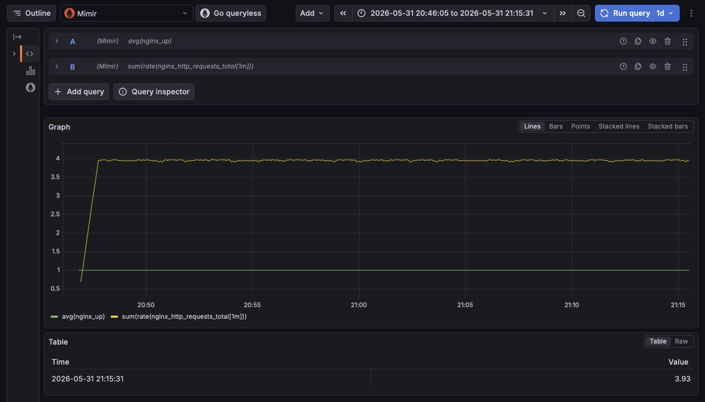
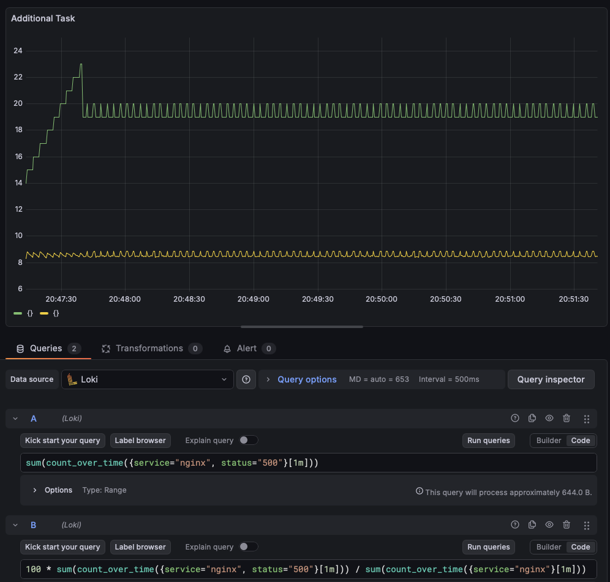
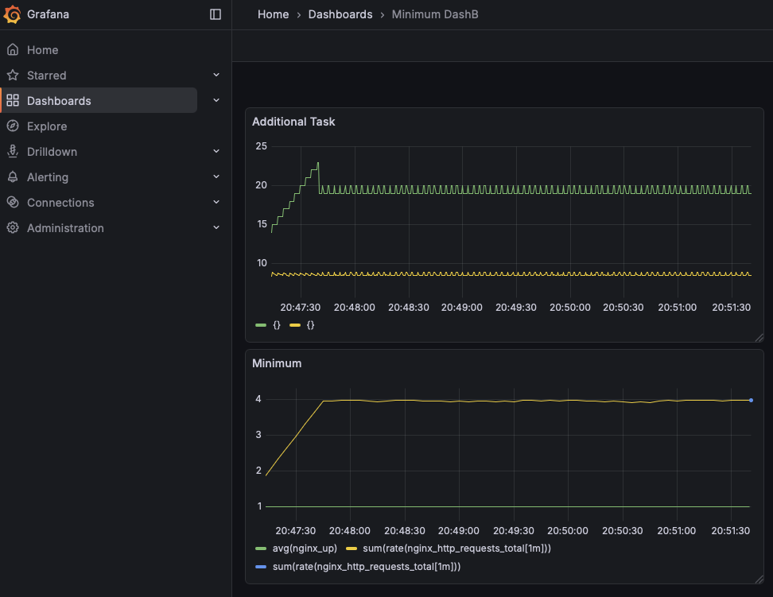
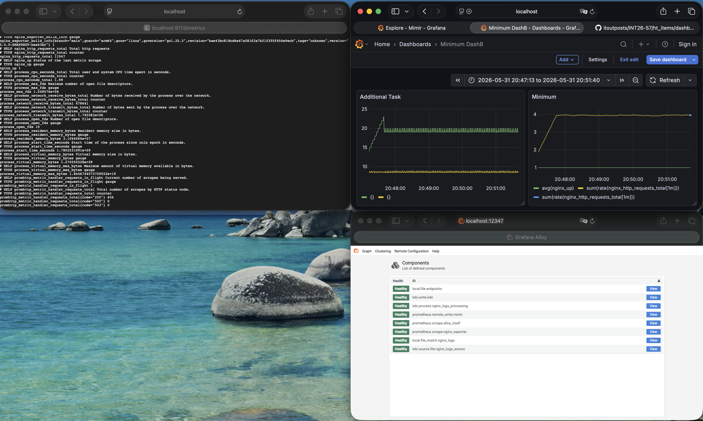
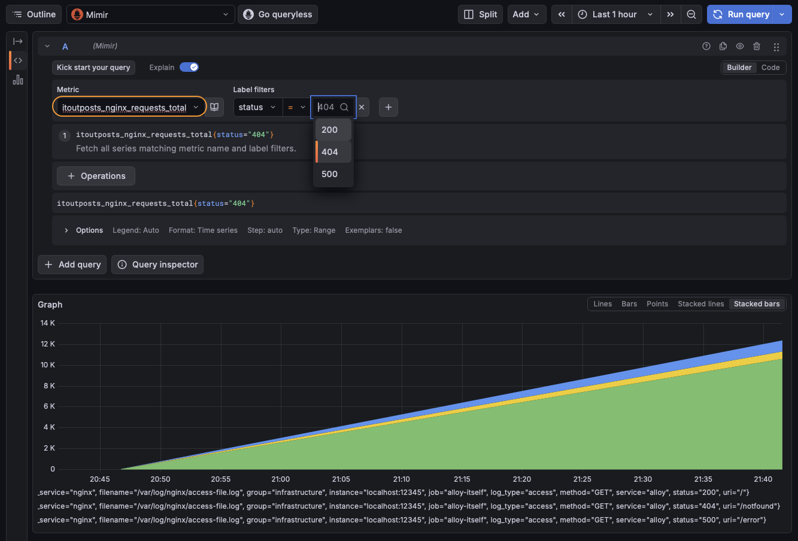
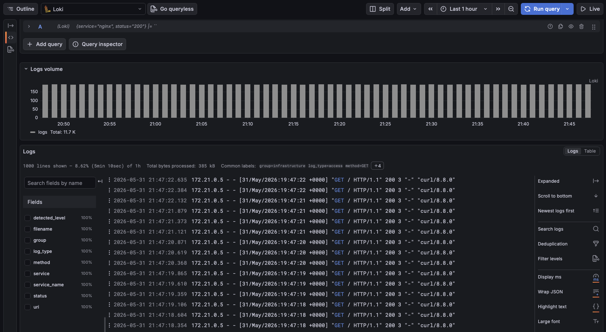

## Minimum Required Tasks
Suggested scraped-metric panel queries (PromQL, datasource `Mimir`):
```promql
sum(rate(nginx_http_requests_total[1m]))
```

```promql
avg(nginx_up)
```


## Additional Tasks
```promql
sum(count_over_time({job="nginx",status="500"}[1m]))
```

Error rate from logs (%):
```promql
100 *
sum(count_over_time({job="nginx",status=~"5.."}[1m]))
/
sum(count_over_time({job="nginx"}[1m]))
```


## dashboard panel from that log-based metric.



Open:
- Grafana: `http://localhost:3000`
- NGINX exporter metrics: `http://localhost:9113/metrics`
- Alloy UI/metrics: `http://localhost:12347`



## Expected Deliverables
- Updated Alloy [config:](./ht_items/config.alloy)
- Screenshot of NGINX metrics query in Grafana Explore

- Screenshot of NGINX logs query in Grafana Explore

- Screenshot of a dashboard panel showing request error rate from scraped metrics [DONE]
- Optional: screenshot of a dashboard panel showing 5xx rate using Loki datasource. [DONE]