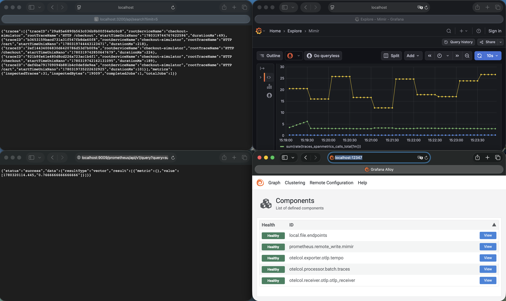
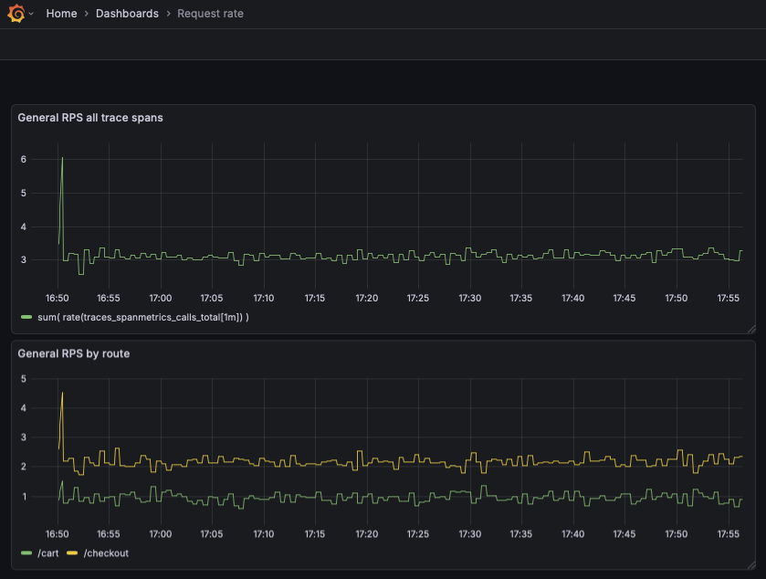
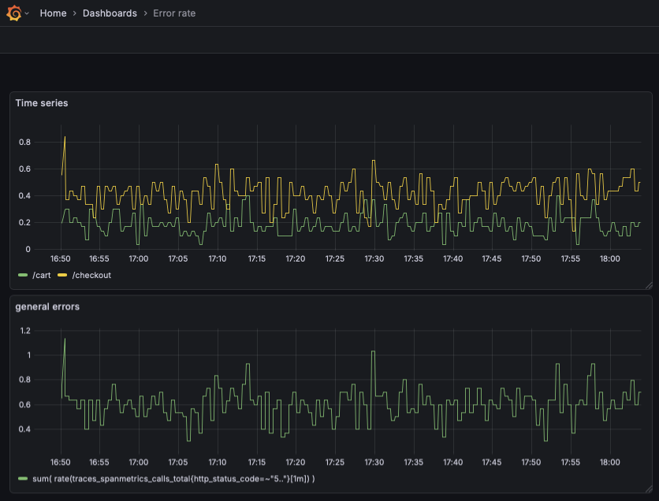
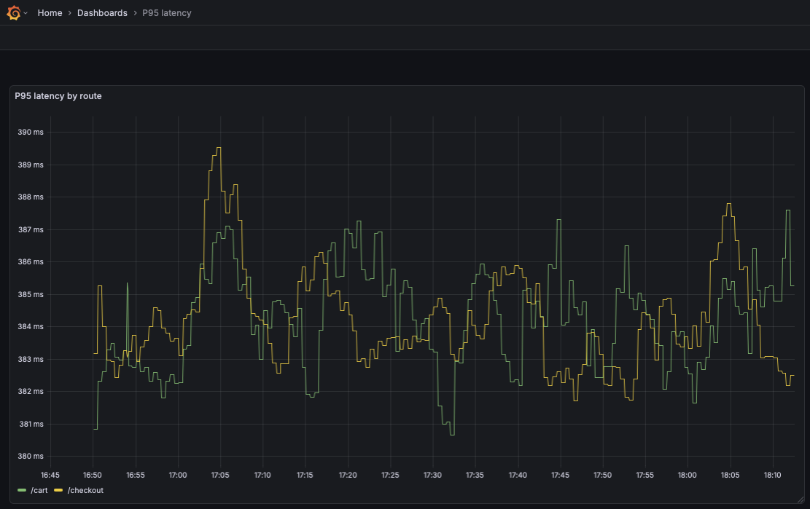
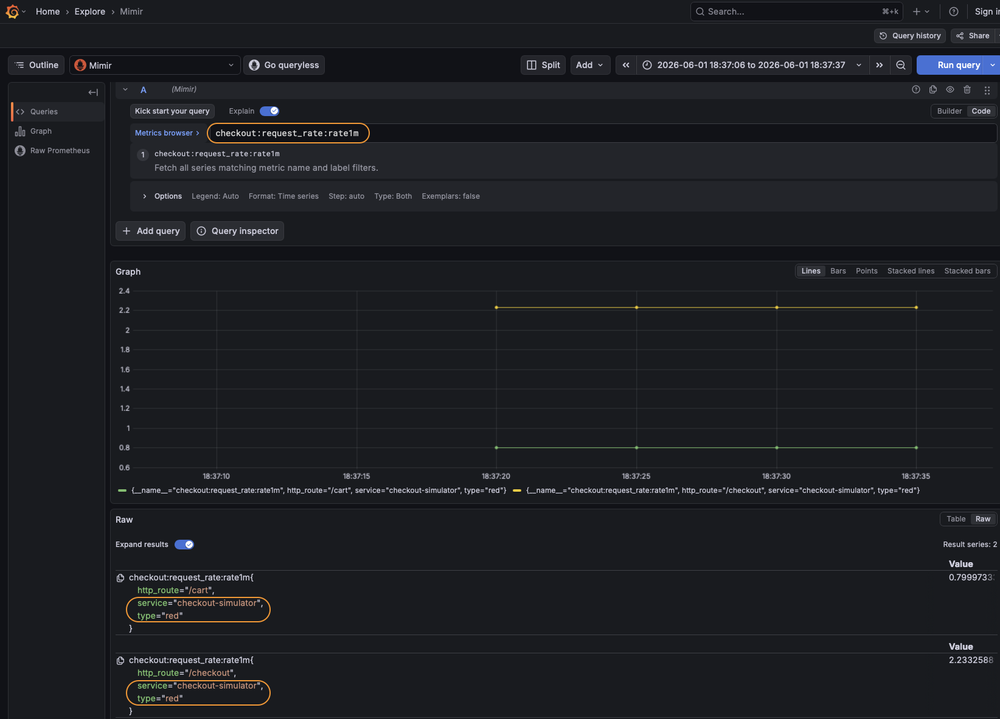
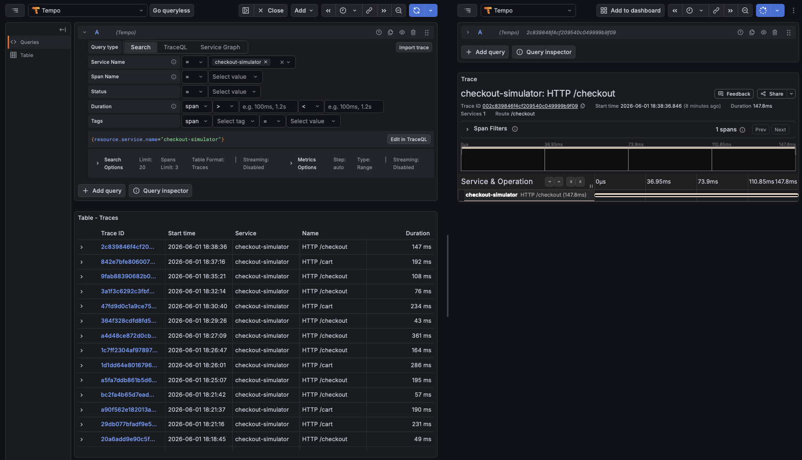

## The Homework Stack
- Grafana: `http://localhost:3000`
- Alloy UI/metrics: `http://localhost:12347`
- Tempo API: `http://localhost:3200`
- Mimir API: `http://localhost:9009`



## Additional Tasks (More Points)
1. Add extra RED dimensions (for example endpoint/route and HTTP status code). [DONE]
2. Build two panels:
   - request rate
   - error rate



3. Build a latency panel using RED histogram metrics (p95 or average).

4. Add recording rules in Grafana for RED metrics.



## Suggested Validation Steps
1. Verify traces exist in Tempo:
```bash
curl 'http://localhost:3200/api/search?limit=5'
```

```json
{"traces":[{"traceID":"160aa4145adbde4c5eada18349fd0a7e","rootServiceName":"checkout-simulator","rootTraceName":"HTTP /cart","startTimeUnixNano":"1780332994786532543","durationMs":58},{"traceID":"50f347456c6646890cda245b15c630d","rootServiceName":"checkou
```


2. Verify RED call metric exists in Mimir:
```bash
curl 'http://localhost:9009/prometheus/api/v1/query?query=traces_spanmetrics_calls_total'
```

```json
{"status":"success","data":{"resultType":"vector","result":[{"metric":{"__name__":"traces_spanmetrics_calls_total","http_method":"GET","http_route":"/cart","http_status_code":"200","job":"checkout-simulator","service_name":"checkout-simulator","span_kind":"SPAN_KIND_INTERNAL","span_name":"HTTP /cart","status_code":"STATUS_CODE_OK"},"value":[1780333171.525,"5814"]},{"metric":{"__name__":"traces_spanmetrics_calls_total","http_method":"GET","http_route":"/cart","http_status_code":"500","job":"checkout-simulator","service_name":"checkout-simulator","span_kind":"SPAN_KIND_INTERNAL","span_name":"HTTP /cart","status_code":"STATUS_CODE_ERROR"},"value":[1780333171.525,"1448"]}...
```

3. Verify RED latency metric exists in Mimir:
```bash
curl 'http://localhost:9009/prometheus/api/v1/query?query=traces_spanmetrics_latency_count'
```

```json
{"status":"success","data":{"resultType":"vector","result":[{"metric":{"__name__":"traces_spanmetrics_latency_count","http_method":"GET","http_route":"/cart","http_status_code":"200","job":"checkout-simulator","service_name":"checkout-simulator","span_kind":"SPAN_KIND_INTERNAL","span_name":"HTTP /cart","status_code":"STATUS_CODE_OK"},"value":[1780333359.604,"5968"]},{"metric":{"__name__":"traces_spanmetrics_latency_count","http_method":"GET","http_route":"/cart","http_status_code":"500","job":"checkout-simulator","service_name":"checkout-simulator","span_kind":"SPAN_KIND_INTERNAL","span_name":"HTTP /cart","status_code":"STATUS_CODE_ERROR"},"value":[1780333359.604,"1502"]},{"metric":{"__name__":"traces_spanmetrics_latency_count","http_method":"GET","http_route":"/checkout","http_status_code":"200","job":"checkout-simulator","service_name":"checkout-simulator","span_kind":"SPAN_KIND_INTERNAL","span_name":"HTTP /checkout","status_code":"STATUS_CODE_OK"},"value":[1780333359.604,"14081"]},{"metric":{"__name__":"traces_spanmetrics_latency_count","http_method":"GET","http_route":"/checkout","http_status_code":"500","job":"checkout-simulator","service_name":"checkout-simulator","span_kind":"SPAN_KIND_INTERNAL","span_name":"HTTP /checkout","status_code":"STATUS_CODE_ERROR"},"value":[1780333359.604,"3383"]}]}}
```

4. Verify error signals exist:
```bash
curl 'http://localhost:9009/prometheus/api/v1/query?query=sum(rate(traces_spanmetrics_calls_total{status_code="STATUS_CODE_ERROR"}[1m]))'
```

```json
{"status":"success","data":{"resultType":"vector","result":[]}}
```


## Expected Deliverables
- Updated Alloy [config](./ht_items/config.alloy)
- Screenshot showing traces in Tempo

- Screenshot showing RED metrics in Mimir/Prometheus query
- Screenshot of at least one RED dashboard panel in Grafana