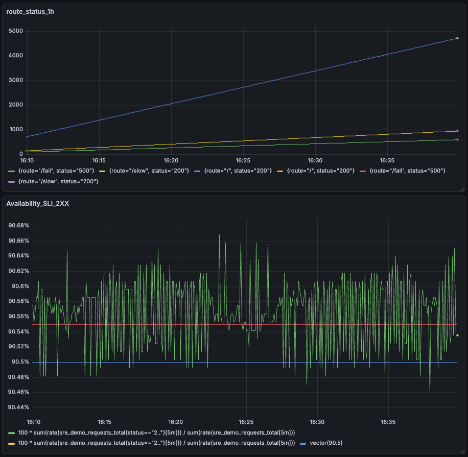

# SRE Demo: Availability SLI and Grafana Visualization



## Overview

This dashboard demonstrates a simple SRE monitoring setup using Prometheus and Grafana.

The service exposes Prometheus metrics at:

```text
http://localhost:8080/metrics
```

The dashboard contains two main panels:

1. Request count by route and HTTP status over the last 1 hour
2. Availability SLI based on successful `2xx` responses

---

## Metrics Used

The service exposes the following counter metric:

```promql
sre_demo_requests_total
```

This metric counts total HTTP requests and includes two labels:

```text
route
status
```

Example labels:

```text
route="/", status="200"
route="/slow", status="200"
route="/fail", status="500"
```

---

## Panel 1: Requests by Route and Status

### Panel name

```text
route_status_1h
```

### Purpose

This panel shows how many requests were received by each route and HTTP status during the last 1 hour.

It helps understand traffic distribution across the service and shows which endpoints are producing successful or failed responses.

### PromQL query

```promql
sum by (route, status) (
  increase(sre_demo_requests_total[1h])
)
```

### Explanation

`increase(...[1h])` calculates how much the counter increased over the last hour.

`sum by (route, status)` groups the result by route and HTTP status.

This allows us to see request volume separately for endpoints such as:

```text
/
 /slow
 /fail
```

and statuses such as:

```text
200
500
```

From the screenshot, most requests are successful `200` responses for the `/` route, while the `/fail` route produces `500` errors.

---

## Panel 2: Availability SLI

### Panel name

```text
Availability_SLI_2XX
```

### Selected SLI

The selected SLI is **availability**.

Availability is measured as the percentage of requests that return a successful `2xx` HTTP status code.

### SLO target

The SLO target is:

```text
90.5%
```

This means the service is considered healthy when at least 90.5% of requests return a `2xx` status code.

### PromQL query

```promql
100 *
sum(rate(sre_demo_requests_total{status=~"2.."}[5m]))
/
sum(rate(sre_demo_requests_total[5m]))
```

### Explanation

The numerator calculates the rate of successful `2xx` requests over the last 5 minutes:

```promql
sum(rate(sre_demo_requests_total{status=~"2.."}[5m]))
```

The denominator calculates the rate of all requests over the last 5 minutes:

```promql
sum(rate(sre_demo_requests_total[5m]))
```

The division gives the ratio of successful requests to all requests.

Multiplication by `100` converts the result into a percentage.

---

## SLO Target Line

The dashboard also includes a static SLO target line:

```promql
vector(90.5)
```

This creates a constant horizontal line at `90.5%`.

The target line makes it easier to visually compare the real availability SLI against the SLO.

---

## Visualization

The Availability panel is shown as a time series graph.

It contains:

- a green line showing the current availability SLI
- a blue horizontal line showing the SLO target
- a threshold marker around the target value

This makes it clear whether the service is above or below the required availability level.

---

## Result

Based on the screenshot, the availability SLI is around:

```text
90.5% - 90.55%
```

The current value is very close to the SLO target.

At the end of the graph, the availability is approximately:

```text
90.53%
```

Since the SLO target is `90.5%`, the service is currently slightly above the target and is meeting the SLO.

However, the value is very close to the threshold, so even a small increase in `5xx` errors could cause the service to fall below the SLO.

---

## Conclusion

The service is currently meeting the defined availability SLO.

The Grafana dashboard shows that the percentage of successful `2xx` requests is slightly above the `90.5%` target. The first panel provides additional context by showing request volume grouped by route and status, while the second panel directly visualizes the selected SLI and compares it against the SLO target.